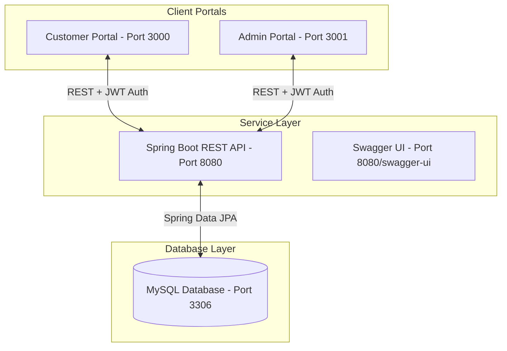

# AURA — Enterprise E-Commerce Platform

A production-ready, full-stack enterprise e-commerce platform built with a decoupled architecture containing a Spring Boot REST backend and two dedicated React Client SPAs: a Customer Portal and an Admin Portal.

---

## 🏗️ Architecture Design & Tech Stack



### Technical Specifications
- **Customer Portal**: React 19, React Router, Redux Toolkit (RTK), Axios, Tailwind CSS, Framer Motion, React Hook Form.
- **Admin Portal**: React 19, React Router, RTK, Axios, Tailwind CSS, Chart.js.
- **Backend API**: Spring Boot 3.4, Spring Security, JWT stateless authentication, Spring Data JPA, Hibernate, Maven, Swagger/OpenAPI.
- **Database**: MySQL 8.0, DBeaver compatible.
- **Containerization**: Docker Compose.

---

## 📁 Repository Structure

```
.
├── admin-portal/             # React Admin dashboard portal
│   ├── src/                  # Charts & Management views
│   └── Dockerfile            # Container configuration
│
├── customer-portal/          # React Customer store portal
│   ├── src/                  # Catalogue & Checkout views
│   └── Dockerfile            # Container configuration
│
├── backend/                  # Spring Boot Maven API
│   ├── src/main/java/        # Security configs & feature packages
│   └── Dockerfile            # Container configuration
│
├── database/                 # SQL schemas and seed data
│   ├── schema.sql            # Table definitions (23 tables)
│   └── seed.sql              # Audits, products & admin users seed
│
├── docker/                   # Docker deployment configurations
│   └── docker-compose.yml    # Combined environment compose
│
├── docs/                     # OpenAPI specs & documentations
│   └── api-spec.md           # API endpoints map
│
└── postman/                  # Postman collections
    └── collection.json       # Test runner queries JSON
```

---

## 🔒 Relational Database Design (23 Tables)

The database schema is fully normalized and optimized for high-volume transactions:

```mermaid
erDiagram
    USERS ||--o{ ADDRESSES : "has"
    USERS ||--o{ ORDERS : "places"
    USERS ||--oO WISHLIST : "likes"
    USERS ||--oO REVIEWS : "writes"
    USERS ||--o| CART : "owns"
    USERS }o--o{ ROLES : "holds"
    
    CATEGORIES ||--o{ PRODUCTS : "contains"
    BRANDS ||--o{ PRODUCTS : "manufactures"
    PRODUCTS ||--o{ PRODUCT_IMAGES : "visualizes"
    PRODUCTS ||--o{ PRODUCT_VARIANTS : "defines"
    PRODUCTS ||--o{ CART_ITEMS : "in"
    PRODUCTS ||--o{ ORDER_ITEMS : "in"
    PRODUCTS ||--o{ WISHLIST : "in"
    PRODUCTS ||--o{ REVIEWS : "in"
    PRODUCTS ||--o{ INVENTORY : "stocked in"
    PRODUCT_VARIANTS ||--o{ INVENTORY : "variants stock"
    
    CART ||--o{ CART_ITEMS : "contains"
    CART_ITEMS }o--|| PRODUCT_VARIANTS : "references"
    
    ORDERS ||--o{ ORDER_ITEMS : "contains"
    ORDERS ||--o| PAYMENTS : "billed"
    ORDERS ||--o| SHIPMENTS : "dispatched"
    ORDERS }o--|| ADDRESSES : "ships to"
    ORDERS }o--|| ADDRESSES : "bills to"
    ORDERS }o--|| COUPONS : "applies"
    ORDER_ITEMS }o--|| PRODUCT_VARIANTS : "references"
    
    COUPONS ||--o{ COUPON_USAGE : "tracks usage"
    COUPONS ||--o{ ORDERS : "discounts"
    USERS ||--o{ COUPON_USAGE : "redeems"
    ORDERS ||--o{ COUPON_USAGE : "applies to"
    
    AUDIT_LOGS }o--|| USERS : "tracks"
    NOTIFICATIONS }o--|| USERS : "alerts"
```

- **DDL definitions**: Standard keys, indexes, cascades, and check rating checks (`chk_review_rating_limit`) are declared in [schema.sql](database/schema.sql).
- **Default Seeding**: Populate categories, products, inventory, coupons, and roles (`ROLE_USER`, `ROLE_ADMIN`) using [seed.sql](database/seed.sql).

---

## 🌿 Git Branching Strategy & Workflow

We employ a strict Gitflow-based branch strategy to support team collaboration:

### Branch Roles
- `main`: Production release branch. Only merged from `develop` after QA sign-off.
- `develop`: Integration branch where all feature branches are combined.
- `feature/*`: Modular branches used to develop specific functionalities.

### Commits Convention
We follow the conventional commits standard:
- `feat: <description>` (e.g. `feat: add order tracking endpoint`)
- `fix: <description>` (e.g. `fix: resolve jwt expiration parsing error`)
- `chore: <description>` (e.g. `chore: configure swagger properties`)

### Collaboration Workflow
1. **Checkout Feature**: Branch off `develop` to implement code (`git checkout -b feature/cart`).
2. **Commit Changes**: Use clear, descriptive commits.
3. **Pull Request (PR)**: Push your feature branch and open a PR targeting `develop`.
4. **Merge Integration**: After code review and green builds, merge into `develop`.

---

## ⚡ Setup & Execution

### Option A: Running with Docker (Recommended)
You can launch the entire ecosystem (portals, API, and MySQL) with a single command:

```bash
cd docker
docker-compose up --build
```
- **Customer Portal**: [http://localhost:3000](http://localhost:3000)
- **Admin Portal**: [http://localhost:3001](http://localhost:3001)
- **Backend Swagger UI**: [http://localhost:8080/swagger-ui/index.html](http://localhost:8080/swagger-ui/index.html)

---

### Option B: Running Locally

#### 1. Database Setup
Create database schema:
```sql
CREATE DATABASE IF NOT EXISTS shopsphere_db CHARACTER SET utf8mb4 COLLATE utf8mb4_unicode_ci;
```
Import `database/schema.sql` and `database/seed.sql` inside **DBeaver** or your SQL shell.

#### 2. Start Backend
```bash
cd backend
mvn clean spring-boot:run
```
The server binds to port **8080**.

#### 3. Start Frontends
For Customer Portal:
```bash
cd customer-portal
npm install
npm run dev -- --port 3000
```
For Admin Portal:
```bash
cd admin-portal
npm install
npm run dev -- --port 3001
```
